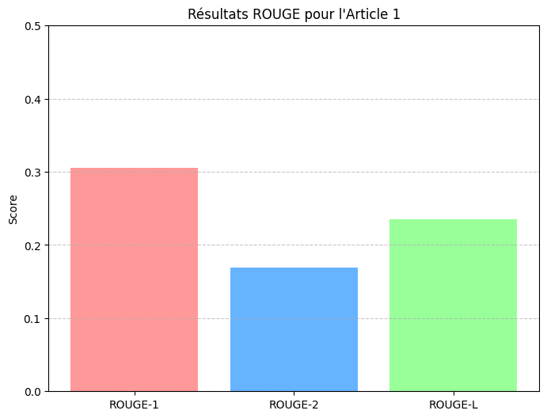
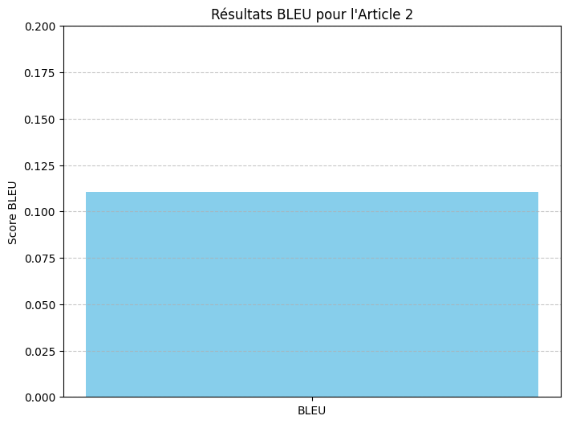
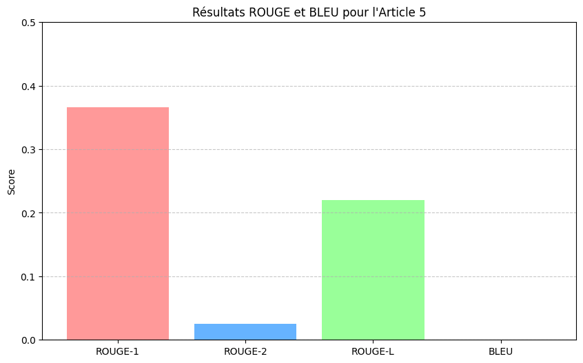

# README.md

Ce projet vise à comparer les performances des résumés extractifs et abstraits générés à l'aide de modèles basés sur des architectures modernes, en utilisant les métriques standard telles que ROUGE et BLEU.

## Objectifs
1. Comprendre les différences entre les approches de résumé extractif et abstrait.
2. Implémenter et évaluer les deux approches à l'aide de jeux de données CNN/Daily Mail.
3. Comparer les performances des résumés générés par les deux approches.

## Fonctionnalités
- Préparation des données : Nettoyage, normalisation et division en ensembles d'entraînement, validation et test.
- Génération de résumés :
  - Approche extractive : Modèles encodeurs comme BERT.
  - Approche abstraite : Modèles encodeur-décodeur comme BART/T5.
- Évaluation des performances : Utilisation des métriques ROUGE et BLEU pour comparer les modèles.
- Visualisation : Graphiques des scores et captures d'écran des évaluations.

---

## Prérequis

### Outils et bibliothèques
- **Python** (3.8 ou supérieur)
- **Bibliothèques Python** :
  - `transformers` : Pour charger les modèles pré-entraînés.
  - `datasets` : Pour gérer le jeu de données CNN/Daily Mail.
  - `nltk` et `spacy` : Pour le traitement du langage naturel.
  - `matplotlib` : Pour les visualisations.
  - `rouge-score` et `nltk.translate.bleu_score` : Pour l'évaluation.

Pour installer les dépendances :
```bash
pip install -r requirements.txt
```

---

## Installation

### Cloner le dépôt
Commencez par cloner ce dépôt sur votre machine locale :
```bash
git clone https://github.com/votre-utilisateur/evaluation-resume.git
cd evaluation-resume
```

### Configuration
1. Assurez-vous que Python est installé sur votre machine.
2. Installez les dépendances listées dans le fichier `requirements.txt` :
   ```bash
   pip install -r requirements.txt
   ```

3. Téléchargez le jeu de données CNN/Daily Mail à l'aide de Hugging Face Datasets :
   ```python
   from datasets import load_dataset
   dataset = load_dataset("cnn_dailymail", "3.0.0")
   ```

---

## Captures d'écran
1. **Résultats ROUGE pour l'Article 1** :
   

2. **Résultats BLEU pour l'Article 2** :
   

3. **Résultats ROUGE et BLEU pour l'Article 5** :
   

---

## Contributions
Les contributions sont les bienvenues ! Veuillez soumettre une *pull request* ou ouvrir une *issue* pour discuter des améliorations.

---

## Licence
Ce projet est sous licence OpenSource. Consultez le fichier [LICENSE](LICENSE) pour plus de détails.

---